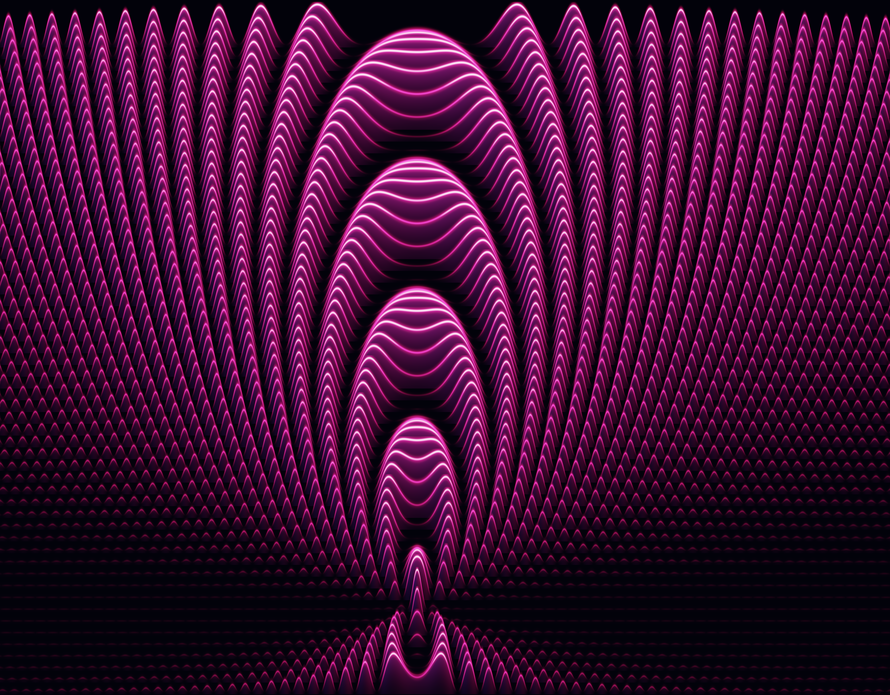
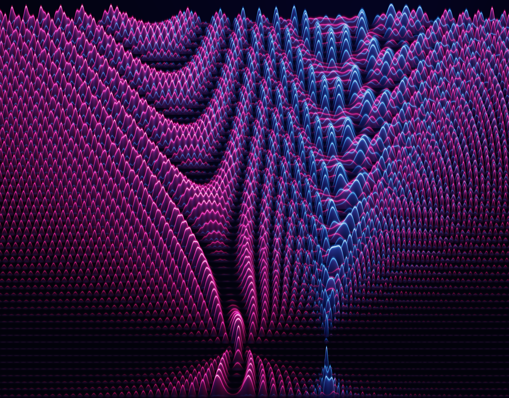
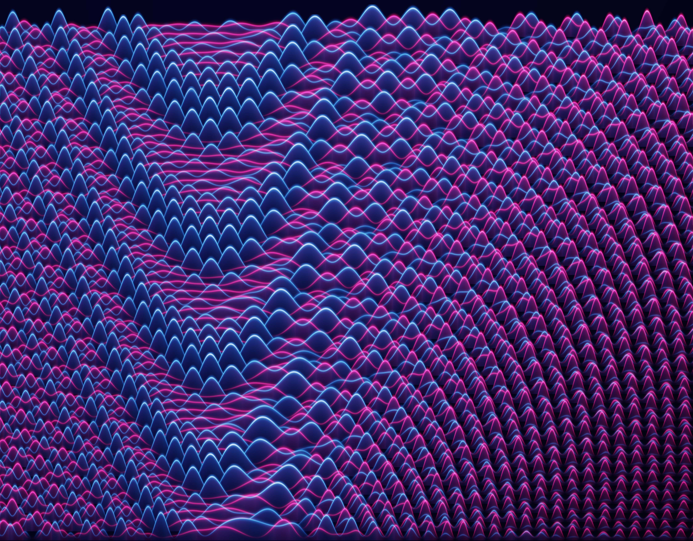

# The Third Level

*A Landscape of Quantum Leakage*

*The Third Level* turns the hidden dynamics of a superconducting qubit into fifty-six luminous profiles stacked like a range of hills. Each traces how the qubit responds as the frequency of a microwave drive changes at a fixed strength. In the ideal two-level picture, this landscape would be symmetric and every fringe would return cleanly to its baseline. The third level present in the physical circuit breaks that balance: magenta shows population reaching the intended computational state, azure shows population leaking away, and the indigo ground marks where the additional level can be reached. As the drive grows stronger, the asymmetry deepens and the magenta fringes stop reaching zero. Every ridge, gap and glow comes from exact solutions of a three-level model, not from randomness or a generative model.

`without-the-third-level.png` shows the ideal two-level model commonly used to describe a qubit. Its response is symmetric around the qubit's resonance: every feature on one side has a counterpart on the other, and the magenta fringes return cleanly to their baselines. With no additional energy level available, no population can leak away and the symmetry holds at every drive strength.



`the-third-level.png` shows the more realistic picture, in which the physical circuit has a third energy level above the two used for computation. This additional level creates new resonances on one side of the landscape and breaks the symmetry of the ideal model. Azure appears where population leaks into it, the two sides no longer match, and the magenta fringes stop returning fully to their baselines. The difference becomes more pronounced as the drive grows stronger.



`the-third-level-detail.png` focuses on the strongly driven region, where the effect of the third level is clearest. Here leakage is no longer a small disturbance: the azure ridges reshape the landscape, the magenta valleys remain open, and the imbalance between the two sides becomes unmistakable. This is where the ideal two-level approximation is no longer enough to capture the full quantum dynamics.



## Reproduce

```bash
uv run the-third-level.py
```

[`uv`](https://docs.astral.sh/uv/) reads the Python version and pinned dependencies from the header of the script itself, so there is no environment to set up. The three submitted plates are exactly what the defaults produce.

```bash
uv run the-third-level.py --width 4500 --dpi 300        # A3: three plates, 4500 × 3516 = 381 × 297 mm
uv run the-third-level.py --width 900 --supersample 1   # fast preview
uv run the-third-level.py --help
```

The program verifies itself before it draws anything, then writes the plates and `diagnostics.json`. No external assets, no network.

All three plates come out at the same pixel size, 4500 × 3516, and the program writes them beside the script.

## The flags

| flag | default | what it does |
| --- | --- | --- |
| `--anharmonicity` | `−0.220` GHz | the device; it moves the resonances |
| `--hold-time` | `120.0` ns | fringe density, which goes as its reciprocal |
| `--lines` | `56` | how many drive amplitudes are drawn |
| `--gain` | `3.5` | profile height in line spacings; pure exaggeration |
| `--width` | `4500` px | A3 at 300 dpi, for all three plates |
| `--supersample` | `2` | oversampling per axis; `1` for a quick look |
| `--dpi` | `300` | written into the PNG; it does not resample |
| `--output-dir` | beside the script | where the plates and `diagnostics.json` go |

## Print size

A3 is 420 × 297 mm, and the three plates are made for it at 300 dpi: 4500 × 3516 px is 381 × 297.7 mm, so the height is exact. The plate is 640 : 500 across to up, which is the window in MHz and not a framing decision, so height is the binding dimension and about 20 mm of paper is left at either side. `--dpi` only writes the number into the PNG header; it resamples nothing.

Do not scale to fit and do not print full bleed.

### Printing at a different dpi

The plate is exactly 15 inches wide, so the rule is one multiplication:

```
width in px = 15 × dpi
```

The height follows from the window on its own, and the paper size does not change. `--dpi` has to move together with `--width`, because it only labels the file and never resamples it.

```bash
dpi=600
uv run the-third-level.py --width $((15 * dpi)) --dpi $dpi --supersample 1
```

| dpi | `--width` | plate | on A3 |
| --- | --- | --- | --- |
| 300 | `4500` | 4500 × 3516 | 381 × 297.7 mm |
| 360 | `5400` | 5400 × 4219 | 381 × 297.7 mm |
| 600 | `9000` | 9000 × 7031 | 381 × 297.6 mm |

Above 300 dpi, drop to `--supersample 1`. Width and supersampling multiply before the buffer is allocated, so 9000 px at `--supersample 2` asks for about 3 GB for the canvas alone, and at that pixel density the plate is already oversampled without it. Every inked feature is a fraction of the image rather than a pixel count, so the drawing itself is identical at any width.

## The physics behind the piece

Most quantum computers being built today keep their information in a small circuit printed on a chip and chilled to about a hundredth of a degree above absolute zero, colder than deep space. Part of that cold is to make the metal superconduct, so current runs around the circuit without losing energy to resistance, and the rest is to keep the circuit quiet enough that stray heat cannot jog it. A circuit like that can hold energy only in certain fixed amounts. Those fixed amounts are called its levels, and the circuit sits on one level or another and never in between, the way a ladder gives you somewhere to stand at some heights and nowhere at all in between them. One part in the circuit, a Josephson junction, makes the gaps between the levels uneven, and that unevenness is the whole reason the thing is usable: if every gap were identical, nothing could nudge the circuit off the bottom level without sending it climbing all the way up. The bottom level is called 0 and the next one up is called 1, physicists write them `|0⟩` and `|1⟩`, and those two levels used as one bit of a program are what anyone means by a qubit. A circuit built this way is called a transmon.

To do anything to a qubit you send it a microwave pulse along a cable, the same family of wave as a wifi signal, but faint and brief. Two dials set that pulse. The first is its pitch: the qubit answers to one particular pitch, and what matters is not the pulse's own pitch but how far it sits from that one, a gap called the detuning. The second is how hard the pulse pushes, its amplitude, which everyone calls the drive. Hold a pulse at some setting and the qubit does not simply move across and stop. It slides from level 0 towards level 1 and back again, over and over, for as long as you hold it, and one of those round trips is called a fringe. Stopping partway through a fringe is how you choose where the qubit is left, anywhere from untouched to all the way across. Stopped partway it is not a coin weighted between the two levels: it is on both at once and carrying a phase, so the different ways of arriving at the same place can cancel each other out. Every null in this picture is that cancelling. Going all the way across is the particular move this piece is about, the `|0⟩ → |1⟩` rotation.

The ladder does not stop at level 1. There is a level 2 just above it, written `|2⟩`, and since the counting starts at the bottom, level 2 is the third level, which is what this piece is named after. The move we are trying to make has no use for it. What usually keeps the qubit away is the unevenness itself: in this device the step from 1 up to 2 is smaller than the step from 0 up to 1 by 220 MHz, a difference with a name of its own, the anharmonicity. A drive sized for one step is the wrong size for the other, so most of the time level 2 is not on offer.

Usually and most of the time are carrying a lot of weight in that paragraph, and this picture is a map of where they give way. They give way completely if you park the drive halfway between the two steps, 110 MHz off the pitch the qubit answers to. Two of the drive's photons together match the 0 to 2 gap exactly there, so even a gentle push of 24 MHz, a tenth of the mismatch, sends ninety-two percent of the qubit up to level 2. That is the bright indigo ridge standing in the plate, and it stands in fifty-four of the fifty-six lines. They give way by degrees everywhere else, because the harder you push the less the mismatch holds: by the time the drive is as strong as the 220 MHz mismatch an eighth of the population has gone to level 2, and at 440 MHz a quarter of it. Keeping population off that level is one of the central problems in building these machines.

Fix how long the pulse is held and two dials are left, so every setting you could then choose is one point on a flat map, detuning across and drive up. This piece is a window on that map, `Δ` from −300 to 340 MHz across and `Ω` from −60 to 440 MHz up. The program goes to a point on it, works out exactly what this three-level model says the qubit would do if the drive were held there for 120 ns, and reads off how much of the qubit arrived on level 1, written `P₁`, and how much ended up on level 2, `P₂`. Whatever is back on level 0 at the end is `P₀`. Each of the three is a share between none of the qubit and all of it, and the name for such a share is a population.

Fifty-six drive strengths are then picked out of that window, each one worked out on its own, and the fifty-six lines are stacked up the page like a range of hills. Each line is a single drive amplitude, left to right along it is the detuning, and its height at any point is where the qubit went. Magenta is `P₁`, the intended `|0⟩ → |1⟩` rotation. Azure is `P₂`, the third level.

In the rotating-wave approximation, with the drive held at a constant detuning `Δ` and amplitude `Ω`,

```
        ⎡  0      Ω/2        0     ⎤
  H  =  ⎢ Ω/2      Δ      √2·Ω/2   ⎥          α = 2π × (−220 MHz)
        ⎣  0    √2·Ω/2   2Δ + α    ⎦
```

This is time-independent, so nothing is integrated. One 3 × 3 real symmetric eigendecomposition per point gives the state exactly,

```
  c_k(t) = Σ_n v_n[k] · v_n[0] · e^{−i E_n t}          P_k = |c_k|²
```

The hold time is 120 ns and belongs to the picture rather than to the device: fringe spacing goes as `1/t`. Every line in the picture is one row of that solve, asked for at its own drive amplitude.

## Determinism

There is no randomness anywhere in the program and no seed to set. Two runs with the same arguments produce the same files.

## License

The source code is licensed under the [MIT License](./LICENSE). The rendered artwork and accompanying text are licensed under [CC BY-NC 4.0](./LICENSE-ARTWORK.md).

## Authorship

Created by Vyron Vasileiadis for the PyCon Greece 2026 Algorithmic Art Exhibition.
